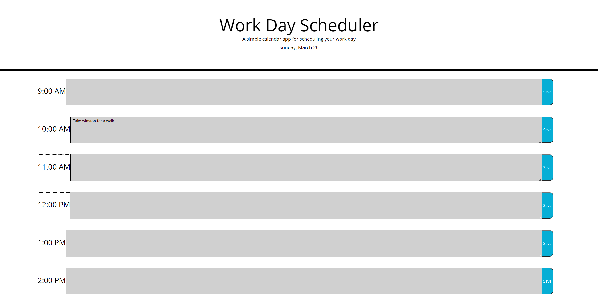

# Challenge 5
# Day Planner by Mason Morris

The objective of this assignment was to create a day planner which persists in localstorage, and which keeps track of whether each hour is in the past, present, or future with color coding. I made this app using HTML, CSS, JavaScript, JQuery, and Day.js.

[CLick here to view the deployed page!](https://masontmorris.github.io/day-planner/)
